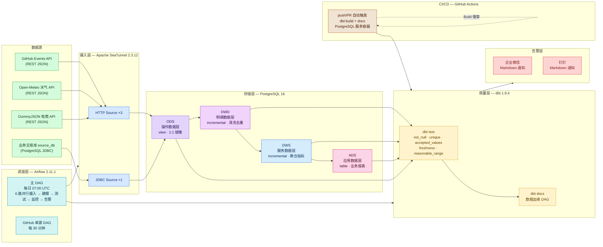

# 企业级数据仓库与数据质量平台

[](https://github.com/Zhuyuxuan0923/ShuShu/actions/workflows/dbt_test.yml)
[](https://github.com/dbt-labs/dbt-core)
[](https://www.postgresql.org/)

完整的多源异构数据集成、四层数仓建模、数据质量监控与告警平台。覆盖 GitHub 事件、天气预报、电商商品、业务交易 4 个数据域，从摄入到 BI 报表全链路自动化。

---

## 架构全景图



---

## 快速开始

```bash
# 1. 配置环境
cp .env.example .env

# 2. 启动全部服务
docker compose up -d

# 3. 访问 Airflow UI
open http://localhost:8080
# 用户名: admin / 密码: admin
```

## 技术栈

| 组件 | 版本 | 用途 |
|------|------|------|
| Apache SeaTunnel | 2.3.12 | 多源数据摄入（HTTP Source + JDBC Source） |
| dbt-core | 1.9.4 | 数据建模、测试、文档、血缘 |
| Apache Airflow | 2.11.1 | 任务调度（CeleryExecutor） |
| PostgreSQL | 16 | 数仓存储 + Airflow 元数据库 |
| GitHub Actions | — | CI/CD 自动化测试 |
| Redis | 7-alpine | Celery broker |
| Docker Compose | 3.9 | 本地开发环境 |

## 数仓分层

| 层 | Schema | 物化策略 | 职责 |
|----|--------|----------|------|
| ODS | ods | view | 源数据 1:1 镜像，类型转换，附加 `_ingested_at` |
| DWD | dwd | incremental | DISTINCT ON 去重、清洗(TRIM/UPPER/LOWER)、标准化、维度拆分 |
| DWS | dws | incremental | 按日/类目/客户聚合，产出服务层指标 |
| ADS | ads | table | 窗口函数(环比/排名)、业务规则(告警/分级)、最终报表 |

## 数据源

| 源 | 类型 | 摄入方式 | 表数 | 数据量 |
|----|------|----------|------|--------|
| GitHub Events API | REST API (JSON) | SeaTunnel HTTP Source | 1 | 30条/次 |
| Open-Meteo Weather API | REST API (JSON) | SeaTunnel HTTP Source | 1 | 24条/次 |
| DummyJSON E-commerce API | REST API (JSON) | SeaTunnel HTTP Source | 1 | 100条/次 |
| **Business Transaction DB** | **PostgreSQL JDBC** | **SeaTunnel JDBC Source** | **3** | **种子 20+50+120 行** |

## 数据质量

- **新鲜度**: `dbt source freshness` 自动检测源数据滞后，超阈值告警（warn/error 两级）
- **唯一性**: 主键 `unique` 约束（如 `event_id`、`order_id`、`customer_id`）
- **非空**: 关键字段 `not_null` 检查（如 `order_date`、`total_amount`、`customer_name`）
- **枚举值**: `accepted_values` 白名单（如 14 种 `event_type`、4 种 `order_status`）
- **值范围**: 通用测试 `reasonable_range`（如 `day_over_day_pct` 在 [-100, 1000]）
- **行数波动监控**: 每日对比各层表行数，波动 >30% 自动企微/钉钉告警（数据管道自愈第一步：异常检测）

## 行数波动监控

数据管道自愈的第一步 —— 异常检测。主 DAG 在每次 dbt 运行后自动执行：

1. 遍历 ods / dwd / dws / ads 四个 schema 下所有表
2. 查询 `COUNT(*)` 得到当前行数
3. 与昨日快照（`dws.row_count_snapshot`）逐表对比
4. 波动率 >30% 的表进入告警列表
5. 通过企微/钉钉 Webhook 推送波动报告
6. 将今日快照写入 `dws.row_count_snapshot` 供次日对比

> 下一步可扩展为：自动回滚到上一个成功的数据版本（自愈）。

## CI/CD

每次 `push` 或 `PR` 到 `main` 分支时自动触发 `.github/workflows/dbt_test.yml`：

```
安装 dbt → 建 Schema → 灌测试数据 → dbt seed → dbt build → dbt docs → 上传产物
```

- **环境**: ubuntu-latest + PostgreSQL 16 (pgvector) 服务容器
- **测试数据**: 6 张 ODS 表, 29 行种子数据
- **dbt build**: 运行全部 21 个模型 + 70+ 数据质量测试
- **产物**: dbt docs HTML 站点 + logs, 保留 7 天
- **超时**: 10 分钟, cancel-in-progress

## 数据血缘

运行以下命令生成本地血缘图：

```bash
cd dbt
dbt docs generate --profiles-dir .
dbt docs serve --profiles-dir .   # 浏览器打开 http://localhost:8080
```

在 dbt docs 的 Lineage 视图中可以看到所有模型的依赖关系 DAG。CI 每次运行也会上传 dbt docs artifact 供下载查看。

> 建议: 截图 lineage 图放到 `docs/dbt-lineage.png`，在 README 中展示。

## 告警消息截图

配置 `.env` 中的 Webhook URL 后，触发 DAG 即可收到企微/钉钉消息：

```
WECOM_WEBHOOK_URL=https://qyapi.weixin.qq.com/cgi-bin/webhook/send?key=YOUR_REAL_KEY
DINGTALK_WEBHOOK_URL=https://oapi.dingtalk.com/robot/send?access_token=YOUR_REAL_TOKEN
```

告警类型：
- **数据质量告警**: dbt test 失败时推送失败详情表格
- **行数波动告警**: 表行数波动 >30% 时推送波动报告
- **通过通知**: 全部测试通过时推送 PASSED 消息

> 建议: 收到真实告警后截图，放在 `docs/` 目录，在这里引用对比图。

## 目录

```
├── .github/workflows/    # CI/CD 流水线 (dbt_test.yml)
├── airflow/
│   ├── dags/             # DAG (主DAG + 单源DAG)
│   └── plugins/           # webhook_notifier + row_count_monitor
├── dbt/
│   ├── models/           # 四层模型 (ods/dwd/dws/ads) 共 21 个
│   ├── macros/           # generate_schema_name / pipeline_metadata / deduplicate / freshness_check
│   ├── tests/            # 通用 + 特定测试
│   └── seeds/            # event_type_categories 映射表
├── docker/               # Airflow + SeaTunnel Dockerfiles
├── docs/                 # 架构/质量框架/运维/接入模板
├── scripts/              # PostgreSQL + Airflow + source_db 初始化
├── seatunnel/
│   ├── config/           # Zeta 引擎配置
│   └── jobs/             # 6 个摄入作业 (3 HTTP + 3 JDBC)
└── docker-compose.yml    # 7 服务编排
```

## 新数据源接入

参见 `docs/onboarding/template.md` — 按模板填写，9 步完成新源接入。

## 文档

- [架构文档](docs/architecture.md)
- [数据质量框架](docs/data_quality_framework.md)
- [运维手册](docs/operations.md)
- [接入模板](docs/onboarding/template.md)
- [接入示例: GitHub Events](docs/onboarding/source_github_events.md)
